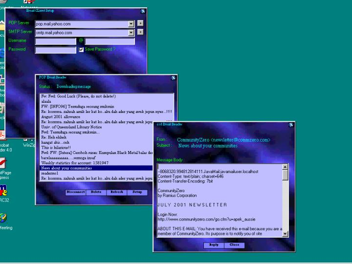



## csD POP Client V1\.0

### Description

As the name suggest, this codes allow you to connect to a POP server and download the messages ( New Email ).Currently didn't support attachments, but I will try to update as soon as I can.Works with most servers.Can't differentiate between new and has been read messages ( Can't figured it out yet, any ideas ?.
 
### More Info
 
The most important matter is that there is no security/encryption options such as SSL/TLS in this codes.Passwords are sent as it is, so make sure sure you are in safe network environment before you try this code.This program are made to demostrate how POP Protocol works.If you found any bugs, please informm me, either on feedback page, or by emailing me.Any votes is greatly appreciated.

UUEncode module is taken from Carl Franklin Book, Visual Basic Internet Programming .

             |
---                |---
**Submitted On**   |2001-08-07 10:41:44
**By**             |[dReaMgRaZeR](https://github.com/Planet-Source-Code/PSCIndex/blob/master/ByAuthor/dreamgrazer.md)
**Level**          |Intermediate
**User Rating**    |4.8 (19 globes from 4 users)
**Compatibility**  |VB 5\.0, VB 6\.0
**Category**       |[Internet/ HTML](https://github.com/Planet-Source-Code/PSCIndex/blob/master/ByCategory/internet-html__1-34.md)
**World**          |[Visual Basic](https://github.com/Planet-Source-Code/PSCIndex/blob/master/ByWorld/visual-basic.md)
**Archive File**   |[csD POP Cl24201862001\.zip](https://github.com/Planet-Source-Code/dreamgrazer-csd-pop-client-v1-0__1-25923/archive/master.zip)

